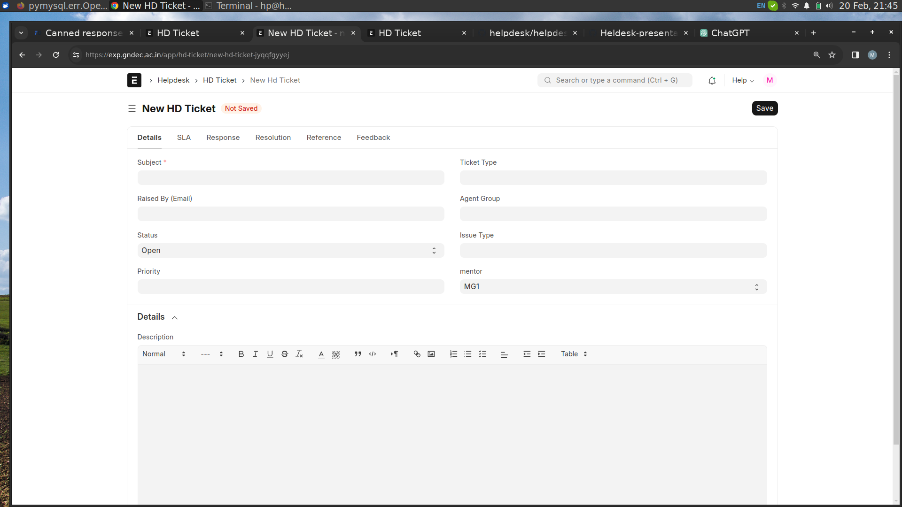

### helpdesk app
##  Why I Create Helpdesk app

helpdesk is a software application. It provide a platform for communication between staff and students. All interactions, such as emails, chat, message and phone calls can be tracked and managed within the app. It provides collaboration tools among support techer allow them to share information, discuss issues and work together to resolve complex problems. In this app you can share any type of data like Image and any type of file. It provides automation features. Its response automates common queries.

## Why I use Frappe
I create helpdesk app in frappe.Because frappe frame work is easy to use.In frappe avaliable many tools liks as form builder and others .

## Requirement 
```sh
1.Easy create a Issue.
2.Give feedback by the customer
3.Create Agent group
4.Knowledge Base
5.Canned Response Message
6.Escalation Rules
7.Deshboard
```
## Doc Types
```sh
HD Ticket 
HD Ticket Comment
HD Notification 
HD pause Service Level Agreement On Status
HD Service Level Agreement Fulfilled On Satus
HD Service Level Agreement 
HD Action
HD Settings
HD Article
HD Article Category
HD Ticket Feedback
HD Ticket Template Field
HD Ticket Tempate
HD Customer
HD Agent 
HD Ticket Type
HD Escalation Rules
HD Ticket Priority
HD Team Iteam
HD Ticket Activity
HD Article Sub Category Item 
HD Present Filter
HD Organization
HD Service Holiday List
HD Aritle Item
HD Article Feedback
HD Team
HD Service Level Priority
HD Canned Response
HD Team Member
HD Present Filter Item
HD Desk Account Request
HD Portal Signup Request 
HD Organization Cantact
HD Holiday 
HD Support Search Sorce 
HD Service Day

```
## HD Ticket

